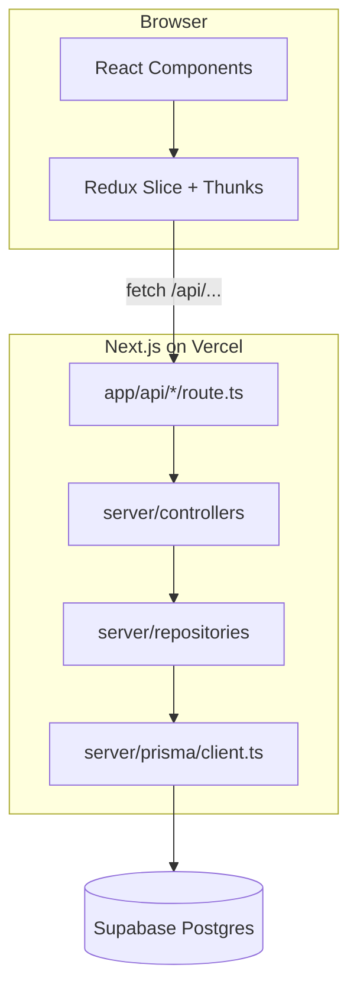

# Architecture Guide

This document explains how the project is structured, how data flows through the stack, and how to add new CRUD resources by copying the `categories` reference implementation.

Back to **[README.md](../README.md)** for setup and deployment.

## Overview

This is a **monolithic Next.js app** — the frontend, API routes, and server logic all live in one codebase and deploy as a single unit to Vercel. There is no separate Express/Nest/FastAPI server.



## Backend layers

Each layer has a single responsibility. Data flows **down** on reads/writes; HTTP responses flow **up**.

| Layer | Path | Responsibility | Example |
|-------|------|----------------|---------|
| API route | `src/app/api/categories/route.ts` | Parse HTTP method, query params, and body; delegate to controller | `GET ?id=` for one, `GET` for list |
| API route | `src/app/api/auth/[action]/route.ts` | Auth endpoints | Delegates to handlers in `auth.ts` |
| Controller | `src/server/controllers/categories_controller.ts` | Validate input, map errors to status codes, return `NextResponse` | 400 when `title` is missing, 404 when not found |
| Controller | `src/server/controllers/auth_controller.ts` | Supabase Auth + sync `public.user` | Signup creates profile row |
| Repository | `src/server/repositories/categories_repository.ts` | Prisma queries only; no HTTP knowledge | `findAll`, `create`, `update`, `delete` |
| Repository | `src/server/repositories/auth_repository.ts` | Prisma user profile queries | `create`, `upsertFromAuth` |
| Prisma client | `src/server/prisma/client.ts` | Singleton client with `@prisma/adapter-pg` | Connects via `DATABASE_URL` |

### Backend rules

- Add `import "server-only"` at the top of every file under `src/server/`.
- Keep server logic in `src/server/`, not in `src/lib/`.
- Use the **App Router** for API routes (`src/app/api/`). Do not add Pages Router handlers (`src/pages/api/`).
- API routes should be thin — parse the request and call the controller.

### Reference: API route

```ts
// src/app/api/categories/route.ts
export async function GET(request: Request) {
  const id = new URL(request.url).searchParams.get("id");
  if (id) return categoriesController.getById(id);
  return categoriesController.list();
}
```

### Reference: controller

Controllers validate input and return structured JSON errors:

```ts
// Returns 400
return NextResponse.json({ error: "title is required" }, { status: 400 });

// Returns 404
return NextResponse.json({ error: "Category not found" }, { status: 404 });
```

### Reference: repository

Repositories only talk to Prisma — no `NextResponse`, no request parsing:

```ts
findAll() {
  return prisma.categories.findMany({ orderBy: { created_at: "desc" } });
}
```

## API design conventions

This project uses a **single route file per resource** (no `[id]` dynamic route segments).

### Categories endpoints

| Method | URL | Body / params | Action |
|--------|-----|---------------|--------|
| `GET` | `/api/categories` | — | List all |
| `GET` | `/api/categories?id={uuid}` | query `id` | Get one |
| `POST` | `/api/categories` | `{ "title": "..." }` | Create |
| `PATCH` | `/api/categories` | `{ "id": "...", "title": "..." }` | Update |
| `DELETE` | `/api/categories?id={uuid}` | query `id` | Delete |

### Error shape

All API errors return:

```json
{ "error": "Human-readable message" }
```

With an appropriate HTTP status code (`400`, `401`, `403`, `404`, `500`, etc.).

## Security: Prisma and Supabase RLS

This template connects to Postgres through **Prisma** using `DATABASE_URL` (direct connection). **Row Level Security (RLS) in Supabase does not apply** on this path. RLS only applies when clients use the Supabase Data API (PostgREST) with the anon or authenticated key and a valid JWT.

**Implication:** access control must be implemented in your **API routes and controllers**, not assumed from RLS policies.

### Authentication (Supabase Auth)

| Piece | Location |
|-------|----------|
| Login / signup UI | `/login`, `/signup` |
| Auth API | `POST /api/auth/login`, `POST /api/auth/signup` |
| Auth layers | `auth_controller.ts` → `auth_repository.ts` → `public.user` |
| Session cookies | `@supabase/ssr` via `src/lib/supabase/*` |
| Session helpers | `src/server/auth/session.ts` — `getSessionUser()`, `requireAuthUser()` |
| UI protection | Client redirect to `/login` on 401 from API |
| API protection | `requireAuthUser()` at the start of protected route handlers |

On signup/login, Supabase Auth handles credentials; `auth_repository` creates or upserts a matching row in `public.user` (same `id` as `auth.users`).

Client `fetch()` calls must use `credentials: "include"` so session cookies are sent.

### Categories access model

The reference `categories` module is **per-user** — each row has `user_id`, and repository queries are scoped by the authenticated user's id from the session.

See **[SECURITY.md](./SECURITY.md)** for a quick checklist.

## Frontend architecture

| Layer | Path | Role |
|-------|------|------|
| Page | `src/app/{entity}/page.tsx` | Thin server shell; imports the list component |
| List | `src/components/{entity}/list.tsx` | Orchestrates table + dialogs; reads Redux state |
| Table / Form / Dialogs | `src/components/{entity}/...` | Presentational UI + local dialog open/close state |
| Redux slice | `src/lib/store/{entity}-slice.ts` | Entity type, async thunks (`fetch` to `/api/...`), reducer |
| Store | `src/lib/store/store.ts` | Register reducers here |
| Hooks | `src/lib/store/hooks.ts` | Typed `useAppDispatch` / `useAppSelector` |
| Shared UI | `src/components/common/` | Reusable pieces (e.g. `async-status.tsx`) |
| Provider | `src/components/providers/redux-provider.tsx` | Wraps the app in `src/app/layout.tsx` |

### Categories component tree

```
src/components/categories/
├── list.tsx                  # Main orchestrator
├── table/
│   └── categories-table.tsx  # Data table with edit/delete actions
├── form/
│   └── category-form.tsx     # Shared form for create + edit
└── dialogs/
    ├── create-dialog.tsx
    ├── edit-dialog.tsx
    └── delete-dialog.tsx
```

### Data flow (CRUD)

```
list.tsx
  → dispatch(fetchCategories())     on mount
  → useAppSelector(state.categories) read items / loading / error

create-dialog.tsx
  → dispatch(addCategory(title))    on submit
  → slice adds new item to state    table re-renders

edit-dialog.tsx
  → dispatch(editCategory({ id, title }))

delete-dialog.tsx
  → dispatch(removeCategory(id))
```

Redux thunks call `fetch("/api/...")` directly — there is no separate API helper file. The slice owns both the type and the HTTP calls.

### Shared async UI

Use `AsyncStatus` from `src/components/common/async-status.tsx` for loading and error states:

```tsx
<AsyncStatus
  loading={loading}
  error={error}
  loadingMessage="Loading categories..."
/>
```

## Database and Prisma

| File | Purpose |
|------|---------|
| `prisma/schema.prisma` | Database models (snake_case table names) |
| `prisma/migrations/` | Versioned SQL migrations |
| `prisma.config.ts` | Prisma 7 config; loads `.env` via dotenv |
| `src/generated/prisma/` | Generated Prisma client (do not edit manually) |
| `src/server/prisma/client.ts` | App-level Prisma singleton |

### Model naming

Models use **snake_case** to match Postgres/Supabase conventions:

```prisma
model categories {
  id         String   @id @default(uuid())
  title      String
  created_at DateTime @default(now())
  updated_at DateTime @updatedAt
}
```

### Local vs production database

| | Local | Production |
|---|--------|------------|
| Provider | Supabase CLI (`npx supabase start`) | Supabase Cloud |
| Postgres port | `54322` | Cloud connection string |
| Studio | http://127.0.0.1:54323 | Supabase dashboard |
| Migrations | `npx prisma migrate dev` | `npx prisma migrate deploy` |

## OpenAPI / Swagger

| File | Purpose |
|------|---------|
| `src/lib/openapi.ts` | OpenAPI 3 spec builder |
| `src/app/api/openapi/route.ts` | Serves spec as JSON at `/api/openapi` |
| `src/app/docs/page.tsx` | Swagger UI at `/docs` |

The docs page uses `swagger-ui-dist` (vanilla bundle), not `swagger-ui-react`, for React 19 compatibility.

When you add a new API resource, extend `src/lib/openapi.ts` with new paths and tags so `/docs` stays up to date.

## Environment variables

See [.env.example](../.env.example):

| Variable | Used for |
|----------|----------|
| `DATABASE_URL` | Prisma connection to Postgres (local or cloud) |
| `NEXT_PUBLIC_SUPABASE_URL` | Supabase project URL (Auth) |
| `NEXT_PUBLIC_SUPABASE_ANON_KEY` | Supabase anon key (Auth) |

After `npx supabase start`, the CLI prints the local values for all three.

## Adding a new CRUD resource

Use `categories` as the template. Below, `{entity}` is your resource name (e.g. `departments`).

### Backend

1. **Schema** — Add or confirm the model in `prisma/schema.prisma`, then run:

   ```bash
   npx prisma migrate dev --name add_{entity}
   npx prisma generate
   ```

2. **Repository** — Create `src/server/repositories/{entity}_repository.ts`
   - Copy `categories_repository.ts`
   - Replace `prisma.categories` with `prisma.{entity}`
   - Adjust fields as needed

3. **Controller** — Create `src/server/controllers/{entity}_controller.ts`
   - Copy `categories_controller.ts`
   - Update validation rules and repository calls

4. **API route** — Create `src/app/api/{entity}/route.ts`
   - Copy `src/app/api/categories/route.ts`
   - Wire to your new controller
   - Call `requireAuthUser()` on every handler

5. **OpenAPI** — Add paths and schemas to `src/lib/openapi.ts`

### Frontend

6. **Redux slice** — Create `src/lib/store/{entity}-slice.ts`
   - Copy `categories-slice.ts`
   - Update type, API URLs (`/api/{entity}`), and slice name

7. **Store** — Register the reducer in `src/lib/store/store.ts`:

   ```ts
   import departmentsReducer from "@/lib/store/departments-slice";

   export const store = configureStore({
     reducer: {
       categories: categoriesReducer,
       departments: departmentsReducer,
     },
   });
   ```

8. **Components** — Create `src/components/{entity}/`:

   ```
   list.tsx
   table/{entity}-table.tsx
   form/{entity}-form.tsx
   dialogs/create-dialog.tsx
   dialogs/edit-dialog.tsx
   dialogs/delete-dialog.tsx
   ```

9. **Page** — Create `src/app/{entity}/page.tsx`:

   ```tsx
   import {Entity}List from "@/components/{entity}/list";

   export default function {Entity}Page() {
     return (
       <main className="mx-auto max-w-4xl p-8">
         <{Entity}List />
       </main>
     );
   }
   ```

10. **Navigation** — Add a link in `src/app/page.tsx`

### Verify

11. Run `npm run build` — fix any TypeScript errors
12. Test CRUD at `http://localhost:3000/{entity}` (signed in)
13. Confirm new endpoints appear at `http://localhost:3000/docs`
14. Confirm unauthenticated API calls return **401**

### Authorization checklist

- [ ] Is data public, auth-only shared, or per-user?
- [ ] `requireAuthUser()` in API route
- [ ] `credentials: "include"` in Redux slice fetches
- [ ] If per-user: `user_id` column + scoped repository queries

## What to modify when cloning

| What | Where |
|------|-------|
| App name / metadata | `src/app/layout.tsx`, `src/app/page.tsx` |
| Database models | `prisma/schema.prisma` |
| Reference CRUD module | `src/components/categories/` (copy pattern, then customize) |
| API documentation title | `src/lib/openapi.ts` |
| Environment | `.env` (local), Vercel project settings (production) |
| Package name | `package.json` `"name"` field |

## Deployment recap

```
Vercel                          Supabase Cloud
┌─────────────────────┐        ┌──────────────────┐
│  Next.js app        │        │  Postgres        │
│  - React UI         │───────▶│  (DATABASE_URL)  │
│  - /api/* routes    │ Prisma │                  │
│  - src/server/*     │        │                  │
└─────────────────────┘        └──────────────────┘
```

No second server. No VPS. One repo, one deploy, one database.
