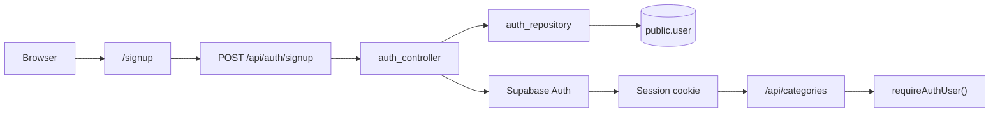

# Security Guide

Quick reference for authentication and authorization in this template.

See also **[ARCHITECTURE.md](./ARCHITECTURE.md#security-prisma-and-supabase-rls)** for the full explanation.

## Auth flow

- **Sign up / sign in:** UI at `/signup`, `/login` → `POST /api/auth/signup` or `POST /api/auth/login`
- **Profile sync:** `auth_repository` creates/upserts `public.user` with the same `id` as Supabase `auth.users`
- **Session:** httpOnly cookies managed by `@supabase/ssr`
- **Protected UI:** `/categories` redirects to `/login` when API returns 401
- **Protected API:** `requireAuthUser()` in route handlers returns **401** if no session

## Prisma vs Supabase RLS

| Path | RLS applies? |
|------|----------------|
| Browser → Supabase Data API (anon/auth key) | Yes |
| Browser → Next.js `/api/*` → Prisma → `DATABASE_URL` | **No** |

This template uses **Prisma with a direct Postgres connection**. Row Level Security policies in Supabase **do not run** on that path.

**Authorization must be implemented in your API routes and controllers**, not assumed from RLS.

## HTTP status codes

| Code | Meaning |
|------|---------|
| **401** | Not signed in |
| **403** | Signed in but not allowed (use when adding ownership checks) |
| **404** | Resource not found |

## Categories access model

`categories` is **per-user** — scoped by `user_id` from the session. Users only see and modify their own categories.

## Checklist for new CRUD resources

When copying the `categories` pattern:

- [ ] Is data **public**, **auth-only shared**, or **per-user**?
- [ ] Call `requireAuthUser()` in the API route
- [ ] Use `credentials: "include"` in client `fetch()` calls
- [ ] If **per-user**: add `user_id` column to the model
- [ ] Scope repository queries: `where: { id, user_id }` — never trust `user_id` from the request body
- [ ] Return **403** when the row exists but the user may not access it

## IDOR warning

If you copy CRUD without ownership checks on user-owned tables, attackers can change the `id` in a request and access another user's records.

Always scope reads and writes by the authenticated user's ID from the session.

## Environment variables

| Variable | Notes |
|----------|-------|
| `DATABASE_URL` | Server-only. Privileged Postgres connection for Prisma. Never expose to the client. |
| `NEXT_PUBLIC_SUPABASE_URL` | Public. Used by Supabase Auth client. |
| `NEXT_PUBLIC_SUPABASE_ANON_KEY` | Public. Used by Supabase Auth client. |
